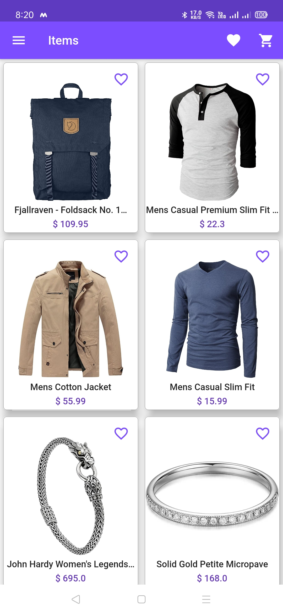
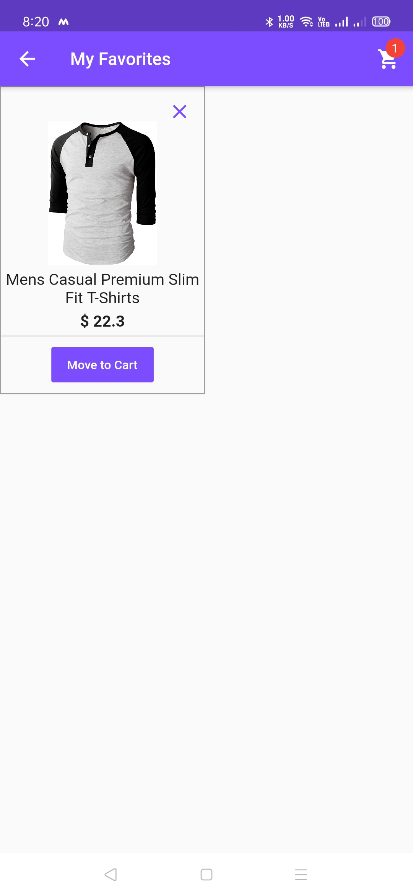
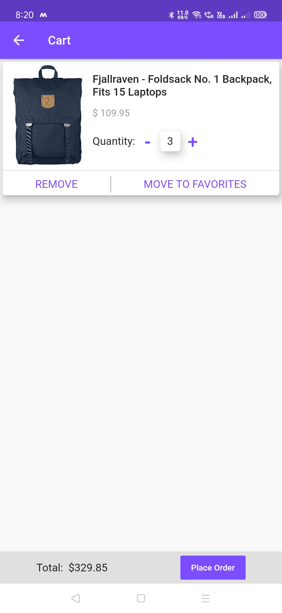
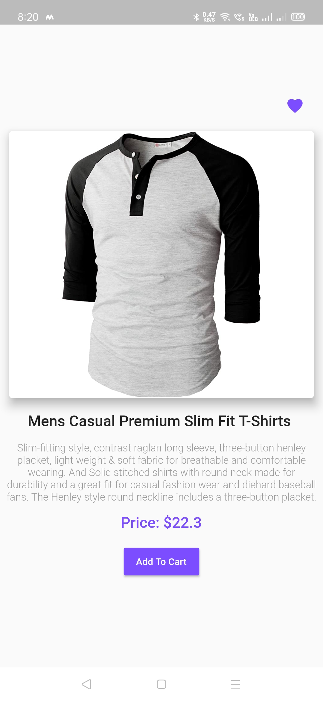
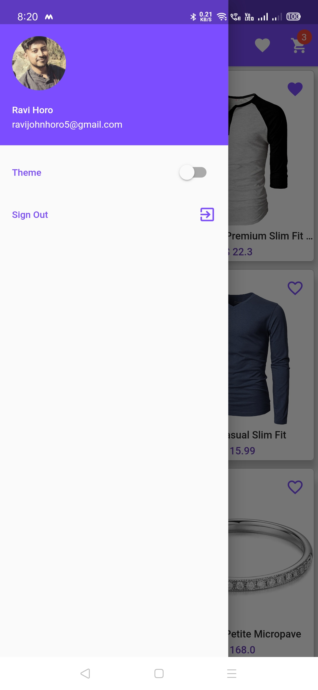
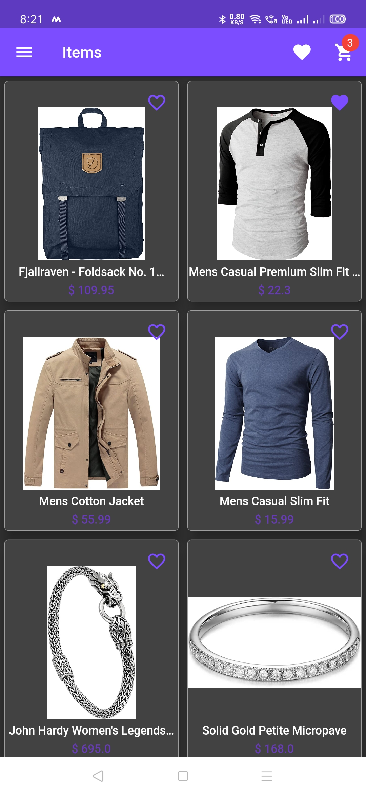

# Cart

An online shopping application built using Flutter

Link to apk: https://drive.google.com/file/d/1sz9vpTbRH8thvyFrWdhUzWTmkSmVvfV8/view

Video link: https://drive.google.com/file/d/166NWCajYXDLnnuLhDibdXiKiBQ0GVJFd/view?usp=sharing

## Features
- Google Sign In
- View products
- Add products to favorites/cart
- Dark/Light Theme
- Follows MVVM architecture implemented using Stacked package

## Tools Used
- Flutter
- Firebase

## Screenshots 
       
