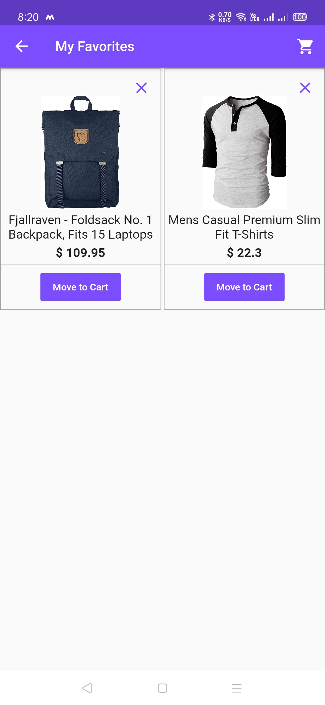

# Cart

An online shopping application built using Flutter

## Features
- Google Sign In
- View products, add to favorites and cart
- Dark/Light Theme

## Tools Used
- Flutter
- Firebase
- Shared Preferences
- Provider State Management

## Screenshots 
       
